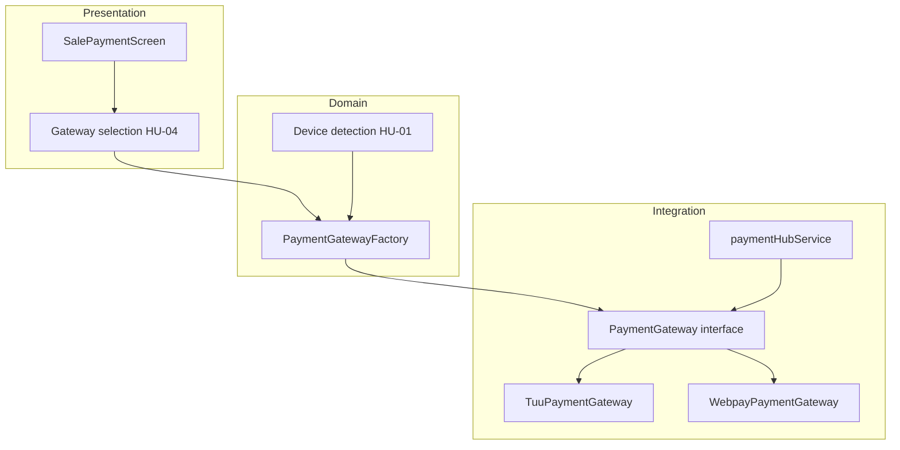

# D-PAY — Arquitectura de pagos multi-gateway

## Visión

Evolucionar POS móvil **sin atar venta al hardware TUU**, vía módulo `PaymentGateway` (adapter/strategy + factory por dispositivo).

## Building blocks

## Reglas arquitectónicas

| ID | Regla |
|---|---|
| AR-01 | UI no conoce SDK Transbank ni Intent TUU directamente |
| AR-02 | Nueva pasarela = nuevo adapter + registro factory |
| AR-03 | Credenciales Transbank solo backend |
| AR-04 | Estado venta unificado en `salesStore` post-pago |
| AR-05 | Regresión TUU obligatoria tras cambio en kernel pagos |

## Flujo Webpay (container view)

1. App → `POST /payments/webpay/create` (API Dtemite)
2. Redirect/WebView sandbox
3. Return → `POST /payments/webpay/commit`
4. App actualiza estado vía respuesta API

## Flujo TUU (container view)

1. Factory selecciona adapter TUU en Kozen
2. Intent Android nativo (legacy encapsulado)
3. Resultado → dominio venta igual que Webpay desde UI

## Extensión futura (documentar, no implementar MVP)

| Pasarela | Patrón |
|---|---|
| Flow | Nuevo adapter + sandbox |
| Mercado Pago | Nuevo adapter + sandbox |
| PayPal | **Pendiente decisión PO** — ADR requerido |

## ADRs sugeridos

- ADR: PaymentGateway pattern (HU-02)
- ADR: Webpay vía backend proxy (HU-03)
- ADR: Exclusión Docker/NFC del MVP
- ADR: PayPal excluido vs docs Fase 1 (cuando PO confirme)

Ver `dpay-adr-catalog`.

## Revisión

Antes de merge arquitectónico → `arch-review` + `dpay-payment-gateway-dev`.
