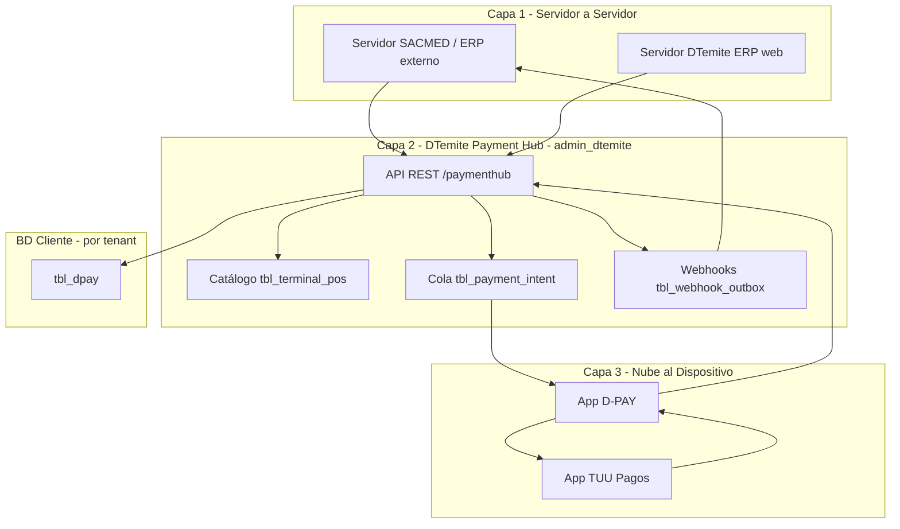
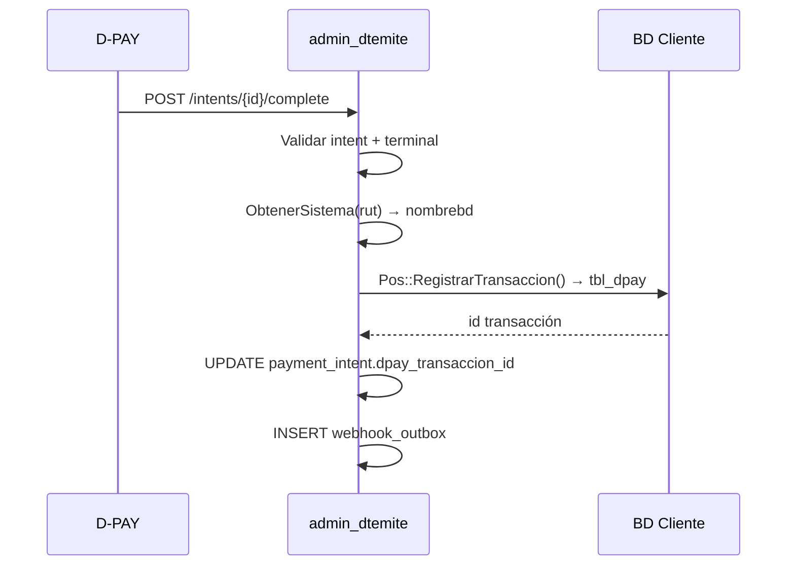
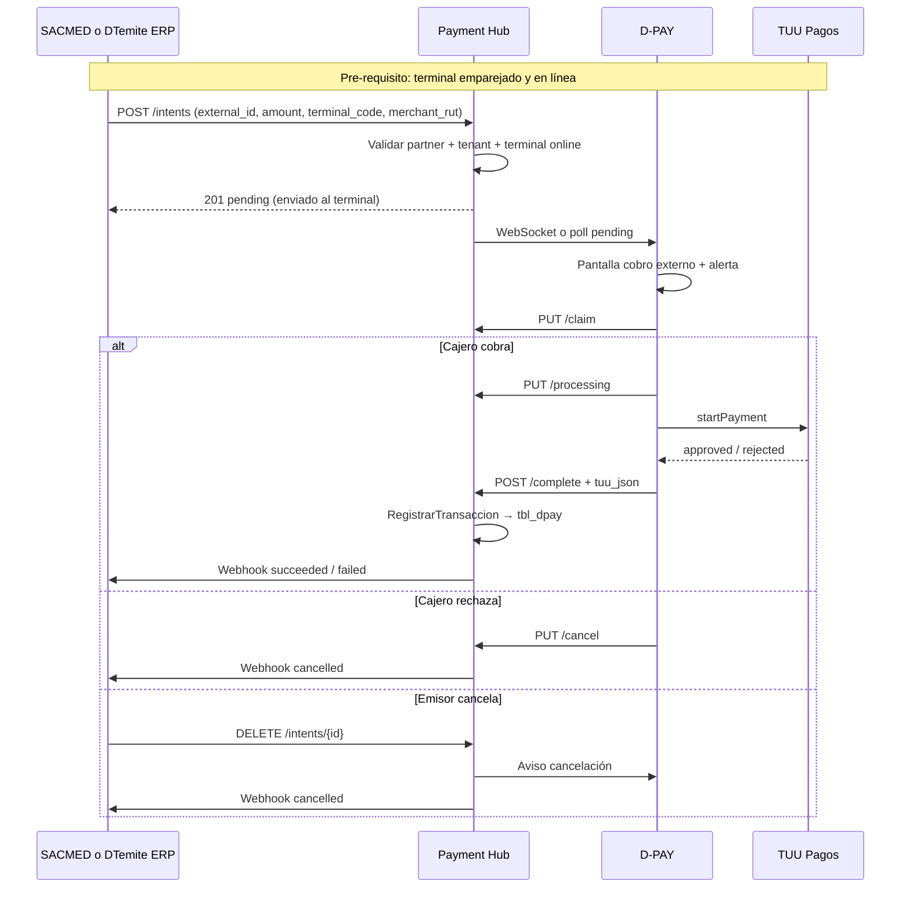
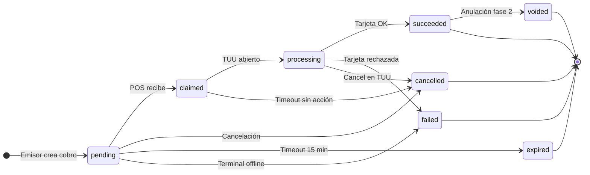
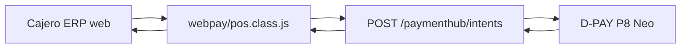

# DTemite Payment Hub — Plan maestro completo

**Versión:** 1.0  
**Fecha:** Junio 2026  
**Proyectos:** `nuevodtemite` (ERP/API) + `dtemite` (D-PAY mobile)  
**Estado:** Plan aprobado para implementación — sin afinaciones pendientes

---

## Tabla de contenidos

1. [Resumen ejecutivo](#1-resumen-ejecutivo)
2. [Visión y reglas de oro](#2-visión-y-reglas-de-oro)
3. [Requerimiento SACMED (origen)](#3-requerimiento-sacmed-origen)
4. [Arquitectura de 3 capas](#4-arquitectura-de-3-capas)
5. [Bases de datos: dónde va cada cosa](#5-bases-de-datos-dónde-va-cada-cosa)
6. [Catálogo de terminales (SN + nombre)](#6-catálogo-de-terminales-sn--nombre)
7. [Nomenclatura estándar del producto](#7-nomenclatura-estándar-del-producto)
8. [Flujo completo del cobro](#8-flujo-completo-del-cobro)
9. [Estados del cobro](#9-estados-del-cobro)
10. [API Payment Hub (endpoints)](#10-api-payment-hub-endpoints)
11. [Ejemplos JSON](#11-ejemplos-json)
12. [Lo que ya existe vs qué construir](#12-lo-que-ya-existe-vs-qué-construir)
13. [Implementación nuevodtemite](#13-implementación-nuevodtemite)
14. [Implementación dtemite (D-PAY)](#14-implementación-dtemite-d-pay)
15. [Integración SACMED](#15-integración-sacmed)
16. [DTemite ERP como emisor](#16-dtemite-erp-como-emisor)
17. [Cancelación y anulación](#17-cancelación-y-anulación)
18. [Seguridad y multi-tenant](#18-seguridad-y-multi-tenant)
19. [Fases y plazos](#19-fases-y-plazos)
20. [Checklist de aceptación](#20-checklist-de-aceptación)
21. [Tareas de implementación](#21-tareas-de-implementación)
22. [FAQ](#22-faq)
23. [Glosario](#23-glosario)

---

## 1. Resumen ejecutivo

Construir **DTemite Payment Hub**: una plataforma en `nuevodtemite` que permite a **cualquier sistema** (SACMED, futuros ERPs, o el propio DTemite web) enviar **solicitudes de cobro** al terminal **D-PAY** del cliente, sin cable físico, vía internet.

- El **integrador** habla solo con la API DTemite (`pro.dtemite.cl/api/v1/paymenthub/`).
- **DTemite** enruta al terminal correcto por `terminal_code` o `serial_number`.
- **D-PAY** en el P8 Neo procesa el pago con **TUU** localmente.
- El **resultado** vuelve al integrador por **webhook** + consulta GET.

**Producto vendible:** mismo estándar API para N clientes, N integradores, 1 a 1.000+ POS por cliente.

---

## 2. Visión y reglas de oro

### Visión

| # | Capacidad |
|---|-----------|
| 1 | Cualquier **integrador externo** (SACMED hoy) manda cobros al POS del cliente |
| 2 | El **DTemite ERP** (panel web) también manda cobros al terminal D-PAY |
| 3 | **D-PAY** es el único que ejecuta TUU en hardware certificado |
| 4 | Cada cliente elige **a qué terminal** enviar cada cobro |
| 5 | Escala a **1.000+ POS** con nombres amigables, no solo seriales |

### Reglas de oro

1. **SACMED nunca llama al POS directamente.**
2. **El POS nunca llama a SACMED directamente.**
3. **Todo pasa por DTemite Payment Hub.**
4. **Routing técnico por `serial_number`; selección humana por `terminal_code` + `display_name`.**
5. **Catálogo POS en `admin_dtemite`; pagos finales en BD de cada cliente.**

---

## 3. Requerimiento SACMED (origen)

**Objetivo:** SACMED envía solicitud de cobro a DPAY hacia la máquina POS, **sin cable**, vía cloud.

**Flujo esperado:**
1. SACMED genera solicitud de pago.
2. Envía: ID interno + monto.
3. DPAY recibe y envía al POS correspondiente.
4. Cliente paga con tarjeta.
5. DPAY informa a SACMED: ID interno, monto pagado, ID transacción DPAY, estado.

**Adicional:** cancelación de pendientes; anulación post-pago.

**Respuesta arquitectónica:** Integración **Nube-a-Nube** + capa **Servidor-a-Servidor** (SACMED ↔ DTemite API).

---

## 4. Arquitectura de 3 capas



| Capa | Actores | Protocolo | Responsabilidad |
|------|---------|-----------|-----------------|
| 1 | Integrador ↔ DTemite | HTTPS + Webhooks | Crear, cancelar, consultar cobros |
| 2 | Hub en `admin_dtemite` | Orquestación | Terminales, intents, partners, webhooks |
| 3 | DTemite ↔ D-PAY ↔ TUU | WebSocket/poll + HTTPS | Pantalla cobro, tarjeta, resultado |
| — | BD cliente | PostgreSQL tenant | `tbl_dpay` — registro final del pago |

---

## 5. Bases de datos: dónde va cada cosa

### Aclaración crítica: ¿qué es "Admin"?

| Nombre coloquial | BD PostgreSQL real | Conexión PHP | Función |
|------------------|-------------------|--------------|---------|
| **Admin** | `admin_dtemite` | `admin_bd()` | Registro global del SaaS |
| **Cliente X** | ej. `empresa_76588454_cl` | `cliente_bd_set()` | ERP de ese cliente |
| **Sistema DTemite** | `dtemiteltda_76588454_cl` | `cliente_dtemiteltda_bd()` | ERP interno DTemite — **NO** catálogo global |

> **`dtemiteltda_76588454_cl` NO es la BD admin.** Es un tenant más (DTemite Ltda.) con panel POS Admin cross-tenant que **lee** desde admin.

### Qué va en cada BD

| Dato | BD | Tabla |
|------|-----|-------|
| Config cliente → servidor BD | Admin | `tbl_sistema`, `tbl_server` *(existente)* |
| **Catálogo POS** (SN, código, nombre, sucursal) | Admin | `tbl_terminal_pos` *(nueva)* |
| Cola solicitudes de cobro | Admin | `tbl_payment_intent` *(nueva)* |
| Integradores (SACMED, etc.) | Admin | `tbl_integracion_partner` *(nueva)* |
| Autorización partner ↔ cliente | Admin | `tbl_partner_merchant` *(nueva)* |
| Cola webhooks | Admin | `tbl_webhook_outbox` *(nueva)* |
| Pago procesado (TUU, comisiones) | **BD Cliente** | `tbl_dpay` *(existente)* |
| Trazabilidad pago | BD Cliente | `tbl_dpay_trazabilidad` *(existente)* |

**Resumen:** Catálogo y cola en `admin_dtemite`; dinero en BD de cada cliente.

### Vínculo terminal → tenant (reutilizar existente)

```
tbl_terminal_pos.idsistema  →  tbl_sistema.idsistema
tbl_sistema.rutcliente      =  rut_empresa
tbl_sistema + tbl_server    →  nombrebd  →  BD cliente
```

Usar **`Dpay::ObtenerSistema($rut, $sistema)`** — no inventar otro mecanismo.

### Esquema SQL — `tbl_terminal_pos` (admin_dtemite)

```sql
CREATE TABLE tbl_terminal_pos (
  id                  SERIAL PRIMARY KEY,
  idsistema           INT NOT NULL REFERENCES tbl_sistema(idsistema),
  rut_empresa         VARCHAR(12) NOT NULL,
  serial_number       VARCHAR(64) NOT NULL UNIQUE,
  terminal_code       VARCHAR(32) NOT NULL,
  display_name        VARCHAR(128) NOT NULL,
  description         TEXT,
  branch_name         VARCHAR(128),
  tags                JSONB DEFAULT '[]',
  status              VARCHAR(16) DEFAULT 'active',
  connection_status   VARCHAR(16) DEFAULT 'offline',
  last_heartbeat_at   TIMESTAMPTZ,
  paired_at           TIMESTAMPTZ,
  created_at          TIMESTAMPTZ DEFAULT NOW(),
  updated_at          TIMESTAMPTZ DEFAULT NOW(),
  UNIQUE (rut_empresa, terminal_code)
);

CREATE INDEX idx_terminal_rut ON tbl_terminal_pos(rut_empresa);
CREATE INDEX idx_terminal_sistema ON tbl_terminal_pos(idsistema);
CREATE INDEX idx_terminal_branch ON tbl_terminal_pos(rut_empresa, branch_name);
```

### Esquema SQL — tablas adicionales (admin_dtemite)

```sql
CREATE TABLE tbl_integracion_partner (
  id                  SERIAL PRIMARY KEY,
  nombre              VARCHAR(128) NOT NULL,
  api_key_hash        VARCHAR(256) NOT NULL,
  webhook_secret      VARCHAR(256),
  webhook_url_default TEXT,
  activo              BOOLEAN DEFAULT TRUE,
  created_at          TIMESTAMPTZ DEFAULT NOW()
);

CREATE TABLE tbl_partner_merchant (
  id           SERIAL PRIMARY KEY,
  partner_id   INT NOT NULL REFERENCES tbl_integracion_partner(id),
  idsistema    INT NOT NULL,
  rut_empresa  VARCHAR(12) NOT NULL,
  activo       BOOLEAN DEFAULT TRUE,
  created_at   TIMESTAMPTZ DEFAULT NOW(),
  UNIQUE (partner_id, rut_empresa)
);

CREATE TABLE tbl_payment_intent (
  id                    SERIAL PRIMARY KEY,
  partner_id            INT REFERENCES tbl_integracion_partner(id),
  idsistema             INT NOT NULL,
  rut_empresa           VARCHAR(12) NOT NULL,
  terminal_id           INT NOT NULL REFERENCES tbl_terminal_pos(id),
  serial_number         VARCHAR(64) NOT NULL,
  terminal_code         VARCHAR(32) NOT NULL,
  external_id           VARCHAR(128) NOT NULL,
  amount                BIGINT NOT NULL,
  currency              VARCHAR(3) DEFAULT 'CLP',
  status                VARCHAR(32) NOT NULL DEFAULT 'pending',
  metadata_json         JSONB DEFAULT '{}',
  dpay_transaccion_id   INT,
  expires_at            TIMESTAMPTZ,
  created_at            TIMESTAMPTZ DEFAULT NOW(),
  completed_at          TIMESTAMPTZ,
  UNIQUE (partner_id, external_id)
);

CREATE TABLE tbl_webhook_outbox (
  id                SERIAL PRIMARY KEY,
  payment_intent_id INT NOT NULL REFERENCES tbl_payment_intent(id),
  partner_id        INT NOT NULL,
  evento            VARCHAR(64) NOT NULL,
  payload_json      JSONB NOT NULL,
  intentos          INT DEFAULT 0,
  proximo_intento   TIMESTAMPTZ,
  entregado_at      TIMESTAMPTZ,
  created_at        TIMESTAMPTZ DEFAULT NOW()
);
```

### Flujo al completar pago



---

## 6. Catálogo de terminales (SN + nombre)

### Problema

Un cliente con 1.000 POS no puede buscar `KZN8P2A12345678`. Necesita elegir **"Caja Recepción — Providencia"**.

### Solución: doble identificador

| Campo | Quién define | Ejemplo | Uso |
|-------|--------------|---------|-----|
| `serial_number` | Hardware (inmutable) | `ABC12345` | Routing técnico, heartbeat |
| `terminal_code` | Admin cliente (único/empresa) | `CAJA-01` | **API e integradores** |
| `display_name` | Admin cliente | `Caja Recepción` | UI dropdown |
| `description` | Admin cliente | `Planta 1 acceso principal` | Ayuda visual |
| `branch_name` | Admin cliente | `Clínica Providencia` | Filtro |
| `tags` | Admin cliente | `["urgencias"]` | Búsqueda |

### Regla API al crear cobro

Enviar **uno de**:

```json
{ "terminal_code": "CAJA-01" }
```

```json
{ "serial_number": "ABC12345" }
```

### Flujo UX con muchos POS

1. `GET /paymenthub/terminals?merchant_rut=...&search=recepcion`
2. Usuario elige en UI por nombre/sucursal
3. Guardar `terminal_code` en la venta
4. `POST /paymenthub/intents` con `terminal_code` + monto

### UI selector (referencia)

```
[🔍 Buscar terminal...                    ]
┌─────────────────────────────────────────┐
│ ● Caja Recepción — Providencia    ONLINE│
│ ○ Box 3 Pediatría — Providencia   ONLINE│
│ ○ Caja Urgencias — Las Condes    OFFLINE│
└─────────────────────────────────────────┘
```

---

## 7. Nomenclatura estándar del producto

| Concepto | API | UI / negocio |
|----------|-----|--------------|
| Plataforma | `DTemite Payment Hub` | Hub de Pagos DTemite |
| Solicitud de cobro | `payment_intent` | Solicitud de cobro |
| Terminal | `terminal` | Terminal POS |
| Serial hardware | `serial_number` | Número de serie |
| Código corto | `terminal_code` | Código de terminal |
| Nombre visible | `display_name` | Nombre del POS |
| Empresa | `merchant_rut` / `rut_empresa` | RUT empresa |
| Integrador | `partner` | Integrador |
| Estado inicial | `pending` | Enviado al terminal |

**Base URL:** `https://pro.dtemite.cl/api/v1/paymenthub/`  
**Sandbox QA:** `https://proqa.dtemite.cl/api/v1/paymenthub/`

---

## 8. Flujo completo del cobro



### 6 pasos en lenguaje simple

1. Emisor crea cobro ($15.990 → terminal `CAJA-01`).
2. Hub valida y encola en admin.
3. D-PAY muestra pantalla "Cobro externo — $15.990".
4. Cajero cobra con tarjeta vía TUU.
5. D-PAY reporta resultado al Hub.
6. Hub registra en `tbl_dpay` y notifica al emisor por webhook.

**Tiempo típico:** 30 seg – 2 min (depende del cliente en TUU).

---

## 9. Estados del cobro



| API | Negocio | Duración | Acción permitida |
|-----|---------|----------|------------------|
| `pending` | Enviado al terminal | 1–5 seg | Cancelar |
| `claimed` | Recibido en POS | segundos | Cancelar |
| `processing` | Cobrando en TUU | 30–120 seg | Cancel en TUU |
| `succeeded` | Pagado | Final | Anular (fase 2) |
| `failed` | Rechazado | Final | Nuevo intent |
| `cancelled` | Cancelado | Final | — |
| `expired` | Expirado | Final | Nuevo intent |
| `voided` | Anulado | Final | — |

---

## 10. API Payment Hub (endpoints)

### Integradores (SACMED, ERPs externos)

| Método | Ruta | Descripción |
|--------|------|-------------|
| POST | `/paymenthub/intents` | Crear solicitud de cobro |
| GET | `/paymenthub/intents/{id}` | Consultar estado |
| GET | `/paymenthub/intents?external_id=` | Buscar por ID externo |
| DELETE | `/paymenthub/intents/{id}` | Cancelar pendiente |
| POST | `/paymenthub/intents/{id}/void` | Anular pagado (fase 2) |
| GET | `/paymenthub/terminals` | Listar terminales (búsqueda, paginación) |
| GET | `/paymenthub/terminals/{code_or_sn}` | Detalle terminal |
| GET | `/paymenthub/terminals/{code_or_sn}/status` | online / offline / busy |

### D-PAY (terminal)

| Método | Ruta | Descripción |
|--------|------|-------------|
| GET | `/paymenthub/intents/pending` | Cola del terminal (poll) |
| PUT | `/paymenthub/intents/{id}/claim` | Tomar solicitud |
| PUT | `/paymenthub/intents/{id}/processing` | TUU abierto |
| POST | `/paymenthub/intents/{id}/complete` | Resultado → tbl_dpay |
| PUT | `/paymenthub/intents/{id}/cancel` | Cancelar desde POS |
| POST | `/paymenthub/terminal/heartbeat` | Latido cada 30 seg |
| POST | `/paymenthub/terminals/register` | Emparejar terminal |

### DTemite ERP (interno)

| Método | Ruta | Descripción |
|--------|------|-------------|
| POST | `/paymenthub/intents` | Mismo endpoint, auth sesión ERP |
| GET | `/paymenthub/terminals` | Terminales de la sesión activa |
| PUT | `/paymenthub/terminals/{id}` | Editar nombre, código, sucursal |

### Auth

| Actor | Mecanismo |
|-------|-----------|
| Partner externo | API Key + `tbl_partner_merchant` |
| D-PAY | JWT `{sistema}_{token}` + validación SN |
| ERP web | Sesión PHP + `cliente_login_bd()` |

Agregar `paymenthub` a whitelist en `src/middlewareApi.php`.

---

## 11. Ejemplos JSON

### Crear cobro

```http
POST /api/v1/paymenthub/intents
Authorization: Bearer {partner_api_key}
Idempotency-Key: SACMED-2026-001234
Content-Type: application/json
```

```json
{
  "external_id": "SACMED-2026-001234",
  "merchant_rut": "76588454-1",
  "sistema": "",
  "amount": 15990,
  "currency": "CLP",
  "terminal_code": "CAJA-01",
  "description": "Consulta box 3",
  "metadata": {
    "patient_id": "P-99",
    "box_id": "3"
  },
  "expires_in_seconds": 900
}
```

### Respuesta inmediata

```json
{
  "id": "pi_8f3a2b1c",
  "status": "pending",
  "status_label": "enviado_al_terminal",
  "external_id": "SACMED-2026-001234",
  "amount": 15990,
  "terminal_code": "CAJA-01",
  "serial_number": "ABC12345",
  "terminal_status": "online",
  "created_at": "2026-06-09T20:00:00Z",
  "expires_at": "2026-06-09T20:15:00Z"
}
```

### Listar terminales

```http
GET /api/v1/paymenthub/terminals?merchant_rut=76588454-1&search=recepcion&status=online&page=1&limit=20
```

```json
{
  "terminals": [
    {
      "id": "term_a1b2",
      "terminal_code": "CAJA-01",
      "serial_number": "ABC12345",
      "display_name": "Caja Recepción",
      "description": "Planta 1 — acceso principal",
      "branch_name": "Clínica Providencia",
      "connection_status": "online",
      "tags": ["recepcion", "box-1"]
    }
  ],
  "total": 1,
  "page": 1,
  "limit": 20
}
```

### Webhook — pago exitoso

```json
{
  "id": "evt_a1b2c3",
  "type": "payment_intent.succeeded",
  "created_at": "2026-06-09T20:02:15Z",
  "data": {
    "id": "pi_8f3a2b1c",
    "external_id": "SACMED-2026-001234",
    "dpay_transaction_id": 12345,
    "amount_requested": 15990,
    "amount_paid": 15990,
    "status": "succeeded",
    "terminal_code": "CAJA-01",
    "serial_number": "ABC12345",
    "tuu": {
      "sequence_number": "001234",
      "auth_code": "654321",
      "last4": "1234",
      "payment_type": "debit"
    }
  }
}
```

### Eventos webhook

| Evento | Español |
|--------|---------|
| `payment_intent.created` | Cobro creado |
| `payment_intent.processing` | Cobrando |
| `payment_intent.succeeded` | Pagado |
| `payment_intent.failed` | Rechazado |
| `payment_intent.cancelled` | Cancelado |
| `payment_intent.expired` | Expirado |
| `payment_intent.voided` | Anulado |

**Entrega:** reintentos hasta HTTP 200; firma HMAC `X-DTemite-Signature`. Respaldo: GET estado si no llega webhook en 30 seg.

### Heartbeat D-PAY

```json
{
  "serial_number": "ABC12345",
  "connection_status": "online"
}
```

---

## 12. Lo que ya existe vs qué construir

### nuevodtemite — existente

| Componente | Ubicación |
|------------|-----------|
| API REST | `public/api/index.php` |
| Multi-tenant | `repositories/dpay.class.php` → `ObtenerSistema()` |
| Registro pagos | `POST /pos/transaccion` → `tbl_dpay` |
| Anular / vincular DTE | `PUT /pos/transaccion/{id}/anular`, `/dte` |
| Panel POS web | `views/webpay/pos/` |
| POS Admin | `controllers/posadmin.php` |
| SACMED DTE | `POST /sacmed/documento/sacmed` |
| Middleware API | `src/middlewareApi.php` |

### dtemite — existente

| Componente | Ubicación |
|------------|-----------|
| Login JWT | `src/stores/authStore.ts`, `POST /login` |
| Registrar TUU | `registrarTransaccionTuu()` en `src/services/api.ts` |
| Flujo TUU | `TuuPaymentModule.java`, `PaymentsMethods.tsx` |
| Background | `App.tsx`, `tuuSyncService.ts` |

### Construir (nuevo)

| Componente | Proyecto |
|------------|----------|
| Tablas admin (terminales, intents, partners) | nuevodtemite |
| `controllers/paymenthub.php` + repository | nuevodtemite |
| Panel terminales + ERP "Cobrar en terminal" | nuevodtemite |
| `paymentHubService`, terminalAgent, ExternalPaymentScreen | dtemite |
| SN real en `dispositivo` | dtemite |
| OpenAPI + docs comerciales | docs |

---

## 13. Implementación nuevodtemite

### Archivos

| Archivo | Acción |
|---------|--------|
| `sql/paymenthub.sql` | **Nuevo** — migraciones admin |
| `controllers/paymenthub.php` | **Nuevo** |
| `repositories/paymenthub.class.php` | **Nuevo** |
| `src/middlewareApi.php` | Agregar `paymenthub` whitelist |
| `controllers/sacmed.php` | Delegar cobros a paymenthub |
| `public/Content/Class/webpay/pos.class.js` | Botón cobrar en terminal |
| `views/webpay/pos/index.html` | UI selector terminal |
| `views/configuraciones/terminales/` | **Nuevo** — admin catálogo POS |

### Al complete — reutilizar

```php
// Pseudocódigo
$resultadoSistema = $oDpay->LoginSistema($rut_empresa, $sistema);
$oBD = $this->PDO->cliente_bd_set($resultadoSistema);
$oPos = new Pos($oBD);
$id = $oPos->RegistrarTransaccion(); // mismo que D-PAY hoy
```

---

## 14. Implementación dtemite (D-PAY)

### Archivos

| Archivo | Acción |
|---------|--------|
| `src/services/paymentHubService.ts` | **Nuevo** |
| `src/services/terminalAgent.ts` | **Nuevo** |
| `src/services/paymentOrchestrator.ts` | **Nuevo** — extraer de PaymentsMethods |
| `src/stores/paymentHubStore.ts` | **Nuevo** |
| `src/screens/ExternalPaymentScreen.tsx` | **Nuevo** |
| `src/screens/SettingsScreen.tsx` | Modo pasarela + SN |
| `src/navigation/RootNavigator.tsx` | Overlay global |
| `App.tsx` | Agente en background |
| `SaleCompletedScreen.tsx`, `PaymentsMethods.tsx` | SN real en `dispositivo` |

### Pantalla cobro externo

- Monto grande, `external_id`, origen partner
- Countdown expiración
- Botones: **Cobrar con tarjeta** | **Rechazar**
- v1: sin DTE (solo comprobante TUU); SACMED maneja documentación clínica

### Canal POS ← Hub

| Fase | Canal | Latencia |
|------|-------|----------|
| 1 | Long-poll `GET /intents/pending` | 2–5 seg |
| 2 | WebSocket + FCM wake-up | 0,2–1 seg |

---

## 15. Integración SACMED

**Hoy:** `POST /sacmed/documento/sacmed` — solo DTE, token hardcoded.

**Propuesta:**
1. Registrar SACMED en `tbl_integracion_partner`.
2. Autorizar clientes en `tbl_partner_merchant`.
3. Cobros vía `POST /paymenthub/intents`.
4. Webhook con IDs cruzados + datos TUU.
5. Fase 3: vincular DTE ↔ pago con `PUT /pos/transaccion/{id}/dte`.

---

## 16. DTemite ERP como emisor

Misma API, auth por sesión web. Cajero elige terminal del dropdown (`display_name`), sistema envía `terminal_code` internamente.



---

## 17. Cancelación y anulación

| Situación | Origen | Acción | Webhook |
|-----------|--------|--------|---------|
| Pendiente, TUU no abierto | Partner | DELETE intent | cancelled |
| Pendiente, TUU no abierto | POS | PUT cancel | cancelled |
| Cliente en TUU | POS | ICE-10 TUU | cancelled |
| Pagado sin DTE | Partner | POST void (fase 2) | voided |
| Pagado con DTE | Partner | Nota de Crédito | flujo DTE |

---

## 18. Seguridad y multi-tenant

| Tema | Implementación |
|------|----------------|
| Aislamiento tenant | Partner solo ve `rut_empresa` autorizados |
| Terminal ajeno | Validar SN ↔ idsistema |
| PCI | Datos tarjeta solo en TUU; partner recibe last4 + auth_code |
| Idempotencia | `Idempotency-Key` = `external_id` |
| Webhook | HMAC-SHA256, dedup por `evt_id` |
| Rate limit | 100 intents/min partner; 10/min terminal |

---

## 19. Fases y plazos

### Fase 1 — MVP (6–8 semanas)

| Semana | nuevodtemite | dtemite |
|--------|--------------|---------|
| 1–2 | SQL + paymenthub API + SACMED partner | — |
| 3 | Poll + heartbeat + complete→tbl_dpay | paymentHubService + SN |
| 4 | Webhook outbox | ExternalPaymentScreen |
| 5 | — | terminalAgent + Settings |
| 6 | ERP web cobrar en terminal | E2E |
| 7–8 | OpenAPI + sandbox QA | P8 Neo + TUU PROD |

### Fase 2 — Producción (3–4 semanas)

WebSocket, anulación, FCM, panel POS Admin intents, registro partners.

### Fase 3 — Extensiones

DTE desde cobro externo, efectivo, métricas SLA.

---

## 20. Checklist de aceptación

- [ ] Partner envía cobro sin cable → terminal correcto
- [ ] Selección por `terminal_code` / nombre, no solo SN
- [ ] `GET /terminals` con búsqueda y paginación
- [ ] DTemite ERP web manda cobro al terminal
- [ ] D-PAY muestra cobro en < 10 seg
- [ ] Pago TUU en P8 Neo
- [ ] Registro en `tbl_dpay` BD cliente correcta
- [ ] Webhook con external_id, monto, dpay_id, estado, TUU
- [ ] GET estado como respaldo
- [ ] Cancelación partner + POS
- [ ] Multi-tenant: empresa A aislada de B
- [ ] Partner solo clientes autorizados
- [ ] SN real en dispositivo (no "POS PRO2")
- [ ] OpenAPI + sandbox entregados

---

## 21. Tareas de implementación

| # | Tarea | Proyecto | Prioridad |
|---|-------|----------|-----------|
| 1 | SQL admin: terminales, intents, partners, webhooks | nuevodtemite | P0 |
| 2 | `paymenthub.php` + repository | nuevodtemite | P0 |
| 3 | Middleware whitelist + auth partner | nuevodtemite | P0 |
| 4 | Registrar SACMED en partners | nuevodtemite | P0 |
| 5 | Poll pending + heartbeat + complete | nuevodtemite + dtemite | P0 |
| 6 | ExternalPaymentScreen + orchestrator | dtemite | P0 |
| 7 | SN real + modo pasarela Settings | dtemite | P0 |
| 8 | Webhook outbox | nuevodtemite | P1 |
| 9 | ERP web selector terminal | nuevodtemite | P1 |
| 10 | Panel admin terminales | nuevodtemite | P1 |
| 11 | OpenAPI + Postman + docs | docs | P1 |
| 12 | WebSocket + FCM | ambos | P2 |
| 13 | Anulación post-pago | nuevodtemite | P2 |

---

## 22. FAQ

### ¿"Pendiente" significa cobro offline?

**No.** Es estado transitorio (1–5 seg) mientras la solicitud llega al POS. El cobro es **en línea y en tiempo real** en la misma atención.

### ¿Admin es admin_dtemite o dtemiteltda?

**`admin_dtemite`** directamente (`admin_bd()`). No `dtemiteltda_76588454_cl`.

### ¿Por qué catálogo POS en admin y no en BD cliente?

Partners no conocen `nombrebd`. POS Admin cross-tenant necesita vista central. Routing usa `tbl_sistema` que ya está en admin.

### ¿Integrador necesita conocer el serial?

**No.** Debe usar `terminal_code` o listar terminales por nombre. El serial es para el sistema.

### ¿Se puede vender a múltiples clientes?

**Sí.** Misma API, `tbl_partner_merchant` autoriza qué partner accede a qué cliente, cada cliente sus terminales aislados por `rut_empresa`.

---

## 23. Glosario

| Término técnico | Término negocio |
|-----------------|-----------------|
| `payment_intent` | Solicitud de cobro |
| `pending` | Enviado al terminal |
| `processing` | Cobrando |
| `succeeded` | Pagado |
| `serial_number` | Número de serie |
| `terminal_code` | Código de terminal |
| `display_name` | Nombre del POS |
| `partner` | Integrador |
| `merchant_rut` | RUT empresa cliente |
| Host-to-Host | Servidor a servidor |
| Cloud-to-Cloud | Nube a nube (sin cable) |

---

## Documentos relacionados

- Plan Cursor: `.cursor/plans/pos_bridge_sacmed_59f374f7.plan.md`
- Brief para generar doc SACMED: `docs/PROMPT-generar-documento-sacmed.md`
- Endpoints existentes D-PAY: `ENDPOINTS_DTEMITE.md`

---

**Fin del plan maestro — listo para implementación Fase 1.**
