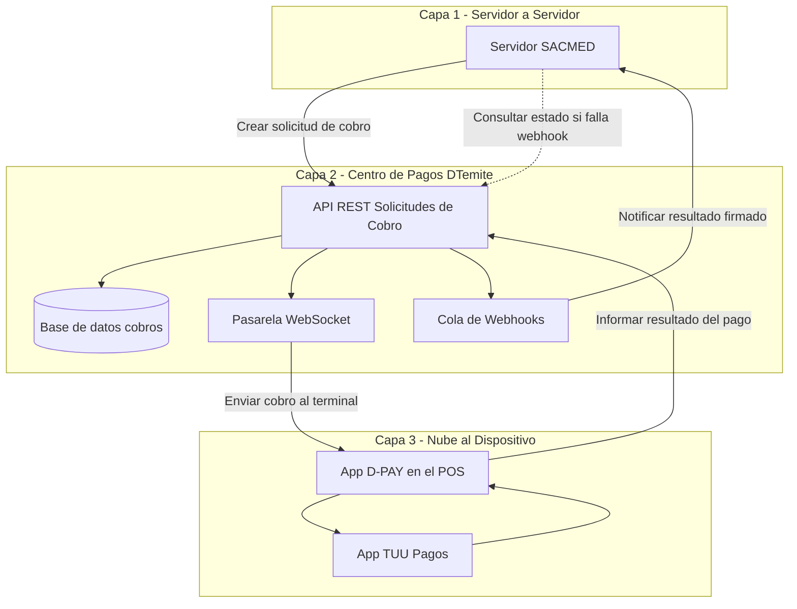
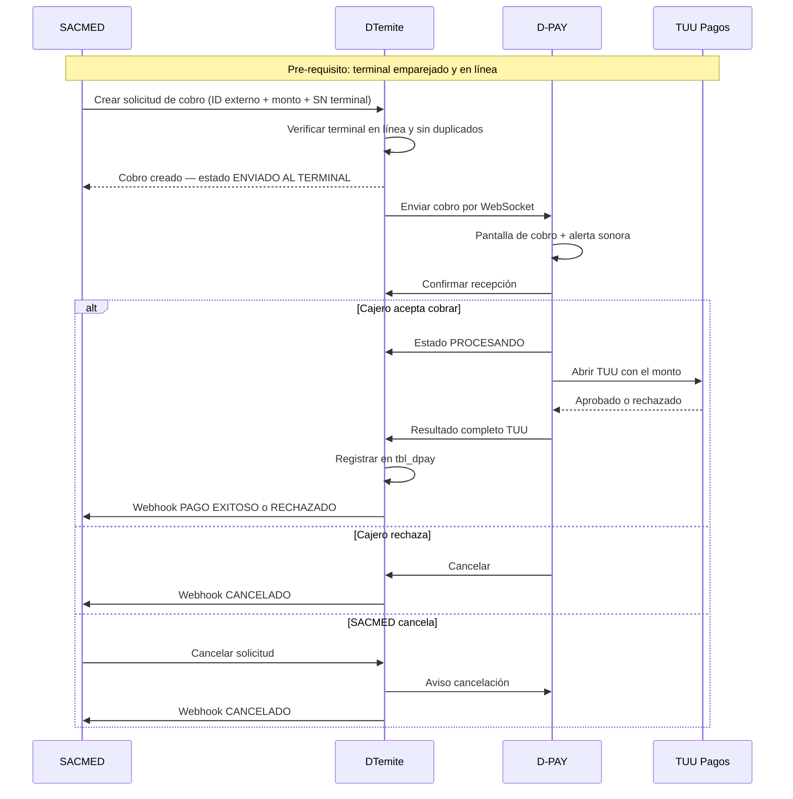
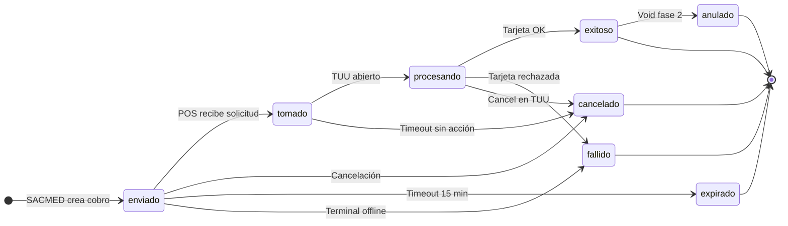
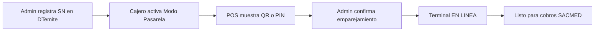
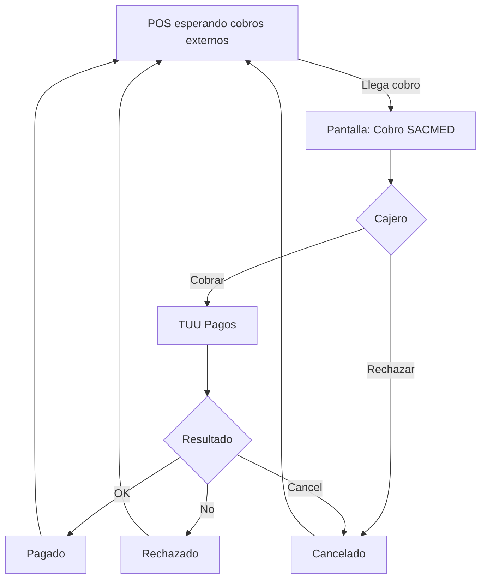

# Brief para IA: generar documento de integración SACMED ↔ D-PAY

> **Uso:** Copia este archivo completo y pásaselo a una IA (ChatGPT, Claude, etc.) con el prompt final de la sección 1.
> **Objetivo:** Que la IA produzca un **documento formal en español** para entregar al equipo de SACMED (técnico + negocio).

---

## 1. Prompt que debes darle a la IA

```
Lee el brief completo que sigue abajo y genera un documento profesional en Markdown titulado:

"Propuesta de Integración Nube-a-Nube: SACMED ↔ DTemite ↔ D-PAY"

Audiencia: equipo técnico y de producto de SACMED + stakeholders DTemite.
Idioma: español (Chile).
Tono: claro, formal, orientado a negocio pero con detalle técnico suficiente para implementar.
Longitud: documento completo (15–25 páginas equivalentes en Markdown).

REQUISITOS DEL DOCUMENTO DE SALIDA:
1. Resumen ejecutivo (1 página)
2. Objetivo de la integración (responder al requerimiento SACMED textualmente)
3. Arquitectura propuesta con diagramas Mermaid (en español)
4. Flujo paso a paso del cobro en tiempo real
5. Sección FAQ: aclarar que "pendiente" NO es cobro offline (ver sección 8 del brief)
6. Estados del cobro con tabla en español
7. Cancelación y anulación
8. Qué integra SACMED (solo API DTemite, nunca el POS)
9. Ejemplos JSON request/response/webhook
10. Endpoints API resumidos
11. Seguridad y PCI (datos de tarjeta solo en TUU)
12. Fases de implementación y plazos estimados
13. Criterios de aceptación checklist
14. Próximos pasos para iniciar piloto
15. Anexo: glosario términos negocio vs técnicos

NO inventes funcionalidades fuera de este brief.
NO omitas la aclaración sobre cobros "en línea" vs estado "pendiente".
Incluye todos los diagramas Mermaid del brief, traducidos y bien formateados.
```

---

## 2. Contexto del proyecto

| Campo | Valor |
|-------|-------|
| **Producto POS** | D-PAY (app React Native en terminal Kozen P8 Neo) |
| **Desarrollador** | DTemite |
| **Pagos con tarjeta** | TUU Pagos (app certificada en el dispositivo) |
| **Integrador externo** | SACMED (sistema de ventas / gestión) |
| **Hub de integración** | API DTemite (`pro.dtemite.cl`) |
| **Tipo de integración** | Nube-a-Nube, sin cable físico entre PC y POS |

### Regla de oro

- SACMED **nunca** se conecta directamente al POS.
- El POS **nunca** se conecta directamente a SACMED.
- **Todo** pasa por DTemite como centro de orquestación.

---

## 3. Requerimiento original de SACMED (texto a citar)

**Objetivo de la integración**

Permitir que SACMED envíe directamente a DPAY una solicitud de cobro hacia la máquina POS, **sin conexión física (sin cable)**, utilizando un mecanismo de integración a evaluar:

- Cloud to Cloud
- Host to Host
- Otra alternativa adecuada

**Flujo esperado**

1. SACMED genera una solicitud de pago.
2. SACMED envía: ID interno de la transacción + monto a cobrar.
3. DPAY recibe la solicitud y la envía a la máquina POS correspondiente.
4. El cliente realiza el pago con tarjeta.
5. Una vez procesada, DPAY debe informar a SACMED:
   - ID interno recibido
   - Monto pagado
   - ID de transacción DPAY
   - Estado (aprobada, rechazada, cancelada, etc.)

**Funcionalidades adicionales**

- Cancelación de transacción pendiente (desde SACMED y desde POS)
- Anulación de pago ya procesado

---

## 4. Respuesta arquitectónica recomendada

**Propuesta:** Integración **Nube-a-Nube** con capa **Servidor-a-Servidor (Host-to-Host)** entre SACMED y DTemite.

| Opción evaluada | ¿Cumple? | Decisión |
|-----------------|----------|----------|
| Centro DTemite en la nube | Sí | **Elegir** |
| Red local PC → POS | No (no es cloud) | Descartar |
| Cable USB | No (requiere cable) | Descartar |
| SACMED → POS directo | No (POS sin IP fija) | Descartar |

**Referencia industria:** mismo patrón que Stripe Terminal, Adyen POS Cloud, Square Terminal API, Worldline Terminal API.

---

## 5. Las 3 capas del sistema



| Capa | Actores | Protocolo | Responsabilidad |
|------|---------|-----------|-----------------|
| 1 | SACMED ↔ DTemite | HTTPS + Webhooks | Crear, cancelar, consultar cobros |
| 2 | DTemite | Orquestación interna | Enrutar, estados, auditoría, reintentos |
| 3 | DTemite ↔ D-PAY ↔ TUU | WebSocket + HTTPS | Pantalla de cobro, tarjeta, resultado |

---

## 6. Flujo completo del cobro (tiempo real)



### Explicación en 6 pasos (para sección de negocio del documento)

1. SACMED registra una venta y solicita cobrar (ej. $15.990) en terminal SN `ABC12345`.
2. DTemite recibe la solicitud y la envía al POS correcto por internet.
3. D-PAY muestra pantalla: "Cobro SACMED — $15.990".
4. Cajero toca "Cobrar con tarjeta" → TUU procesa la tarjeta del cliente.
5. D-PAY informa el resultado a DTemite.
6. DTemite notifica a SACMED por webhook con IDs, monto y estado.

**Tiempo total típico:** 30 segundos a 2 minutos (depende del cliente en TUU).

---

## 7. Estados del cobro



| Estado API (`pending`, etc.) | Nombre para negocio | Duración típica | Significado |
|------------------------------|---------------------|-----------------|-------------|
| `pending` | **Enviado al terminal** | 1–5 seg | Solicitud creada, camino al POS |
| `claimed` | **Recibido en POS** | segundos | Terminal mostró el cobro |
| `processing` | **Cobrando** | 30–120 seg | Cliente pagando en TUU |
| `succeeded` | **Pagado** | Final | Tarjeta aprobada |
| `failed` | **Rechazado** | Final | Tarjeta rechazada |
| `cancelled` | **Cancelado** | Final | Cancelado antes de pagar |
| `expired` | **Expirado** | Final | Nadie cobró a tiempo |
| `voided` | **Anulado** | Final | Reversión post-pago (fase 2) |

---

## 8. FAQ obligatorio: "¿Por qué dice pendiente si el cobro es en línea?"

**Pregunta de SACMED (Sergio Silva):** *"Los cobros serían en línea, no sé si está bien que quede como cobro pendiente."*

**Respuesta que el documento DEBE incluir:**

> El cobro **sí es en línea y en tiempo real**. El estado "pendiente" (`pending`) **no significa** cobro offline ni cobro diferido para después.
>
> Es un **estado técnico transitorio** (1–5 segundos) que indica: *"la solicitud fue creada y está siendo enviada al terminal"*.
>
> En la documentación orientada a negocio usaremos:
> - **"Enviado al terminal"** en lugar de "pendiente"
> - **"Cobrando"** cuando TUU está abierto
> - **"Pagado" / "Rechazado" / "Cancelado"** como estados finales
>
> Desde SACMED, el flujo es **síncrono en la atención al paciente**: crean el cobro, esperan el webhook (o consultan estado), y continúan según el resultado — todo en la misma sesión.

---

## 9. Emparejamiento del terminal



Hardware: terminal **Kozen P8 Neo** con Android 7+, apps **D-PAY** + **TUU Pagos PROD**.

---

## 10. Cancelación y anulación

| Situación | Origen | Acción | SACMED recibe |
|-----------|--------|--------|---------------|
| Antes de abrir TUU | SACMED | DELETE solicitud | Webhook cancelado |
| Antes de abrir TUU | POS (rechazar) | Cancel desde terminal | Webhook cancelado |
| Cliente en TUU | POS | Botón cancelar TUU | Webhook cancelado |
| Ya pagado, sin boleta | SACMED | POST void (fase 2) | Webhook anulado |
| Ya pagado, con boleta DTE | SACMED | Nota de Crédito | Flujo DTE aparte |

---

## 11. Ejemplos JSON (incluir en documento final)

### Crear cobro — SACMED → DTemite

```http
POST /api/v1/payment-intents
Authorization: Bearer {api_key_sacmed}
Idempotency-Key: SACMED-2026-001234
Content-Type: application/json
```

```json
{
  "external_id": "SACMED-2026-001234",
  "amount": 15990,
  "currency": "CLP",
  "terminal_sn": "ABC12345",
  "description": "Consulta box 3",
  "metadata": {
    "patient_id": "P-99",
    "box_id": "3"
  },
  "expires_in_seconds": 900
}
```

### Respuesta inmediata — DTemite → SACMED

```json
{
  "id": "pi_8f3a2b1c",
  "status": "pending",
  "status_label": "enviado_al_terminal",
  "external_id": "SACMED-2026-001234",
  "amount": 15990,
  "terminal_sn": "ABC12345",
  "terminal_status": "online",
  "created_at": "2026-06-09T20:00:00Z",
  "expires_at": "2026-06-09T20:15:00Z"
}
```

### Webhook — pago exitoso

```json
{
  "id": "evt_a1b2c3",
  "type": "payment_intent.succeeded",
  "created_at": "2026-06-09T20:02:15Z",
  "data": {
    "id": "pi_8f3a2b1c",
    "external_id": "SACMED-2026-001234",
    "dpay_transaction_id": 12345,
    "amount_requested": 15990,
    "amount_paid": 15990,
    "status": "succeeded",
    "tuu": {
      "sequence_number": "001234",
      "auth_code": "654321",
      "last4": "1234",
      "payment_type": "debit"
    }
  }
}
```

### Eventos webhook

| Evento | Español | Cuándo |
|--------|---------|--------|
| `payment_intent.created` | Cobro creado | Al crear |
| `payment_intent.processing` | Cobrando | TUU abierto |
| `payment_intent.succeeded` | Pagado | Tarjeta OK |
| `payment_intent.failed` | Rechazado | Tarjeta rechazada |
| `payment_intent.cancelled` | Cancelado | Antes de pagar |
| `payment_intent.expired` | Expirado | Timeout |
| `payment_intent.voided` | Anulado | Post-pago (fase 2) |

**Webhooks:** reintentos hasta HTTP 200, firma HMAC `X-DTemite-Signature`. Respaldo: GET estado si no llega webhook en 30 seg.

---

## 12. Endpoints API para SACMED

| Método | Ruta | Descripción |
|--------|------|-------------|
| POST | `/api/v1/payment-intents` | Crear solicitud de cobro |
| GET | `/api/v1/payment-intents/{id}` | Consultar estado |
| GET | `/api/v1/payment-intents?external_id=...` | Buscar por ID SACMED |
| DELETE | `/api/v1/payment-intents/{id}` | Cancelar (si no pagado) |
| POST | `/api/v1/payment-intents/{id}/void` | Anular (fase 2) |
| GET | `/api/v1/terminals/{sn}/status` | Terminal online/ocupado/offline |

**Sandbox QA:** `https://proqa.dtemite.cl/api/v1/...`  
**Producción:** `https://pro.dtemite.cl/api/v1/...`

---

## 13. Seguridad

| Tema | Detalle |
|------|---------|
| PCI | Datos de tarjeta **solo** en TUU; SACMED recibe last4 + auth_code |
| Auth SACMED | API Key + Idempotency-Key |
| Webhooks | HMAC-SHA256, verificar firma |
| Idempotencia | `external_id` único por partner |
| Terminal | Solo ve cobros de su empresa y su SN |

---

## 14. Qué ve el cajero en D-PAY



Pantalla muestra: monto, ID SACMED, origen, countdown, botones Cobrar/Rechazar.

**v1:** cobros SACMED sin emitir boleta DTE desde POS (SACMED maneja documentación clínica).

---

## 15. Fases y plazos

| Fase | Duración | Entregables |
|------|----------|-------------|
| **1 — MVP** | 5–7 semanas | API, D-PAY modo pasarela, sandbox, piloto cobro tarjeta |
| **2 — Robusto** | 3–4 semanas | Anulación, webhooks garantizados, panel ops |
| **3 — Opcional** | — | DTE desde POS, efectivo, métricas SLA |

---

## 16. Criterios de aceptación (checklist)

- [ ] SACMED envía ID + monto sin cable
- [ ] Enrutamiento correcto por número de serie
- [ ] Cobro visible en POS en menos de 5–10 seg
- [ ] Pago con tarjeta vía TUU en P8 Neo
- [ ] Webhook con: external_id, monto pagado, dpay_transaction_id, estado, datos TUU
- [ ] Consulta GET como respaldo
- [ ] Cancelación desde SACMED y POS
- [ ] Anulación post-pago (fase 2)
- [ ] OpenAPI + sandbox
- [ ] Sin datos de tarjeta completos hacia SACMED

---

## 17. Próximos pasos sugeridos (para sección final del documento)

1. Reunión kick-off técnica SACMED + DTemite
2. Entrega credenciales sandbox QA
3. SACMED implementa POST crear cobro + receptor webhook
4. DTemite habilita terminal de prueba (SN)
5. Prueba end-to-end en P8 Neo
6. Piloto en un punto de atención
7. Go-live producción

---

## 18. Glosario (anexo sugerido)

| Término técnico | Término negocio | Explicación |
|-----------------|-----------------|-------------|
| `payment_intent` | Solicitud de cobro | Intención de cobrar un monto |
| `pending` | Enviado al terminal | Transitorio, segundos |
| `processing` | Cobrando | Cliente en TUU |
| `succeeded` | Pagado | Aprobado |
| `webhook` | Notificación automática | DTemite avisa a SACMED |
| `terminal_sn` | Número de serie POS | Identifica la máquina |
| Host-to-Host | Servidor a servidor | SACMED ↔ DTemite API |
| Cloud-to-Cloud | Nube a nube | Sin cable, vía internet |

---

## 19. Datos de contacto / marca (completar antes de enviar)

| Campo | Valor |
|-------|-------|
| Empresa | DTemite |
| Producto | D-PAY |
| Web | dtemite.cl |
| Documento versión | 1.0 |
| Fecha | Junio 2026 |

---

## 20. Notas para la IA generadora

- Prioriza **claridad para no técnicos** en resumen y FAQ.
- Mantén **rigor técnico** en API, JSON y endpoints.
- **No prometas** fechas exactas de go-live; usa "estimado".
- **No inventes** precios, SLAs contractuales ni certificaciones no mencionadas.
- Si generas PDF después, el Markdown debe tener estructura con `#`, `##`, tablas y Mermaid intactos.
- El documento es **propuesta técnica**, no contrato legal.
