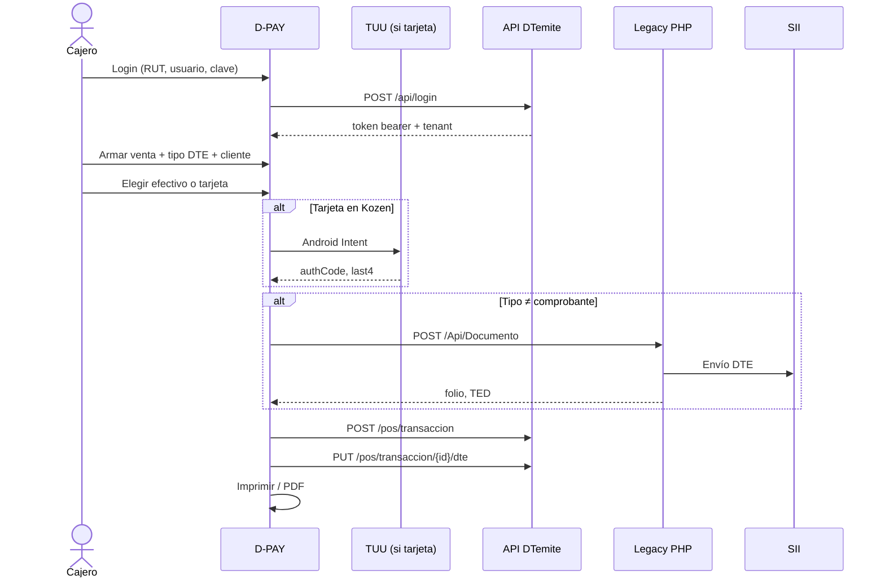
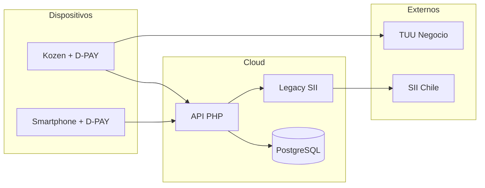

# Arquitectura del Sistema — D-PAY + plataforma DTemite

---

## 1. Visión arquitectónica

**D-PAY** es el cliente móvil del ecosistema DTemite. El ERP web cubre la oficina; D-PAY cubre el punto de venta. Ambos hablan con la misma plataforma: API REST, Legacy PHP (SII) y PostgreSQL multi-tenant.

```
┌─────────────────────────────────────────────────────────────────────────┐
│ PRESENTACIÓN — D-PAY (React Native 0.75.5 + TypeScript)                 │
│  Screens │ Components │ Zustand+MMKV │ Hooks │ Módulos nativos          │
│  Login, Venta, Pago, Historial, NC, Settings, Hub, Impresora            │
│  TuuPayment · ScanBeep · PosDeviceInfo · Bluetooth ESC/POS              │
└─────────────────────────────────┬───────────────────────────────────────┘
                                  │ HTTPS
┌─────────────────────────────────▼───────────────────────────────────────┐
│ SERVICIOS MOBILE                                                        │
│  apiClient.ts │ api.ts (DTE) │ tuuPayment.ts │ paymentHubAgent.ts       │
│  pdf.ts │ ted.ts │ impresión                                                │
└────────────┬────────────────────────────┬───────────────────────────────┘
             │                            │
             ▼                            ▼
┌────────────────────┐         ┌────────────────────┐
│ REST DTemite       │         │ Legacy PHP         │
│ pro.dtemite.cl/api │         │ sistema.dtemite.cl │
│ login, pos, dpay,  │         │ DTE → SII          │
│ hub, catálogo      │         │                    │
└─────────┬──────────┘         └─────────┬──────────┘
          │                              │
          ▼                              ▼
┌─────────────────────────────────────────────────────────────────────────┐
│ DATOS — PostgreSQL                                                      │
│  admin_dtemite          │  BD tenant (empresa_{rut}_cl)                 │
│  tbl_sistema, Hub       │  tbl_dpay, tbl_documento, productos, clientes │
└─────────────────────────────────────────────────────────────────────────┘
          │
          ▼
┌────────────────────┐
│ TUU Negocio        │  (solo Kozen — Intent Android)
└────────────────────┘
```

Detalle de negocio: [00-ecosistema-dtemite.md](./00-ecosistema-dtemite.md).

---

## 2. Stack

### D-PAY (móvil)

| Capa | Tecnología | Versión |
|---|---|---|
| Framework | React Native | 0.75.5 |
| Lenguaje | TypeScript | 5.9.3 |
| Estado | Zustand | 5.x |
| Persistencia | react-native-mmkv | — |
| Navegación | React Navigation | 7.x |
| Firma DTE | jsrsasign (SHA1withRSA) | — |
| PDF | react-native-html-to-pdf | — |
| Bluetooth | react-native-bluetooth-escpos-printer | — |
| Cámara | react-native-vision-camera | — |
| Biometría | react-native-biometrics | — |
| Android | Gradle 8.6, SDK 35, minSdk 24 | — |

### Plataforma DTemite (`nuevodtemite`)

| Capa | Tecnología |
|---|---|
| API | Slim PHP 3.x |
| BD | PostgreSQL + PDO |
| Auth API | Token opaco bearer (`{sistema}_{hash}`) |
| DTE | PHP legacy + SII |
| ERP web | Twig / HTML |

### Entornos

| Entorno | REST | Legacy | Uso |
|---|---|---|---|
| Producción | `pro.dtemite.cl/api` | `sistema.dtemite.cl` | APK release |
| QA | `proqa.dtemite.cl/api` | misma URL legacy | Debug `__DEV__` |

---

## 3. Estructura de la app

```
dpay_3.0/codigo/
├── android/app/src/main/java/com/dtemitepos/
│   ├── TuuPaymentModule.java
│   ├── PosDeviceInfoModule.java
│   ├── ScanBeepModule.java
│   └── MainApplication.kt
└── src/
    ├── screens/          # Login, Sale, Catalogue, Payment, MySales,
    │                     # CreditNote, Settings, Printer, ExternalPayment, …
    ├── components/
    ├── services/
    │   ├── api.ts
    │   ├── apiClient.ts
    │   ├── tuuPayment.ts
    │   ├── paymentHubAgent.ts
    │   ├── pdf.ts
    │   └── ted.ts
    ├── stores/
    ├── navigation/
    ├── hooks/
    ├── utils/
    └── types/
```

---

## 4. Stores

| Store | Archivo | Responsabilidad |
|---|---|---|
| `authStore` | `stores/authStore.ts` | Token, usuario, empresa, b64pass |
| `salesStore` | `stores/salesStore.ts` | Carrito, cliente, tipo DTE |
| `mySalesStore` | `stores/mySalesStore.ts` | Historial local y sync |
| `catalogueStore` | `stores/catalogueStore.ts` | Productos |
| `clientsStore` | — | Clientes |
| `cafStore` | — | CAF para TED |
| `settingsStore` | `stores/settingsStore.ts` | Impresión, documentos, pagos |
| `paymentHubStore` | `stores/paymentHubStore.ts` | Cobros externos |
| `printerStore` | `stores/printerStore.ts` | Impresora Bluetooth |
| `themeStore` | `stores/themeStore.ts` | Tema |

---

## 5. Flujo principal — venta + cobro + DTE



Flujo resumido:

```
Login → Venta → Cobro (efectivo | TUU) → [DTE si tipo ≠ 0] → tbl_dpay → Imprimir
```

---

## 6. Plataforma backend (consumo)

```
nuevodtemite/
├── controllers/     # login, pos, dpay, paymenthub, documento, folios
├── repositories/    # pos.class.php, dpay.class.php, login.class.php, …
├── src/
│   ├── middlewareApi.php   # bearer token
│   └── settings.php
├── sql/
└── views/                  # ERP web, D-POS
```

| API | URL | Auth | Uso D-PAY |
|---|---|---|---|
| REST | `/api/*` | Bearer opaco | Login, catálogo, `tbl_dpay`, Hub |
| Legacy | `ApiIntegracionController` | usuario + `b64pass` | Emisión DTE |

No comparten autenticación. La app guarda token REST y `b64pass` por separado.

---

## 7. Payment Hub

```
Integrador  --X-Api-Key-->  API Hub (tbl_payment_intent)
                                │
                                ▼
                         D-PAY (polling)
                                │
                                ▼
                         Cobro local (TUU)
                                │
                                ▼
                         tbl_dpay + webhook al integrador
```

El integrador nunca habla con el POS en forma directa.

---

## 8. Despliegue



En smartphone el cobro de tarjeta TUU no aplica; el flujo demo es efectivo + DTE.

---

## 9. Casos de uso (resumen)

| ID | Caso | Actor | Resultado |
|---|---|---|---|
| CU-01 | Autenticarse | Cajero | Sesión tenant |
| CU-02 | Realizar venta | Cajero | Carrito listo |
| CU-03 | Cobrar | Cajero + cliente | Pago registrado |
| CU-04 | Emitir DTE | Cajero | Folio SII |
| CU-05 | Consultar historial | Cajero | Lista de ventas |
| CU-06 | Emitir NC | Cajero | Documento 61 |
| CU-07 | Imprimir | Cajero | Ticket |
| CU-08 | Cobro Hub | Integrador + cajero | Intent cerrado |

UML extendido: [15-diagramas-uml.md](./15-diagramas-uml.md).

---

## 10. Decisiones (ADR)

| # | Decisión | Alternativa | Por qué |
|---|---|---|---|
| ADR-01 | App nativa RN, no PWA del ERP | Solo web | Offline, TUU Intent, Bluetooth, UX de caja |
| ADR-02 | Dual API (REST + Legacy) | Migrar DTE a REST | Legacy ya emite al SII en producción |
| ADR-03 | MMKV | AsyncStorage | Rendimiento y menos exposición |
| ADR-04 | Token opaco de DTemite | JWT propio | El login de la empresa ya resuelve tenant |
| ADR-05 | TUU para tarjeta | Pasarela web en el MVP | Hardware y contrato ya usados por DTemite |
| ADR-06 | No reescribir el ERP | Monolito único | D-PAY es el rubro POS, no un segundo ERP |

---

## 11. Integraciones

| Sistema | Protocolo | Dirección | Datos |
|---|---|---|---|
| API DTemite | HTTPS JSON | App ↔ Server | token, catálogo, `tbl_dpay` |
| Legacy DTE | HTTPS JSON | App → Server | XML, folio, TED |
| TUU | Android Intent | App ↔ TUU | monto, authCode, last4 |
| Payment Hub | HTTPS | Bidireccional | intents, resultado |
| SII | vía Legacy | Server → SII | DTE firmados |
| Impresora | Bluetooth ESC/POS | App → printer | ticket |

---

## 12. Configuración de entorno

```typescript
export const API_BASE_URL = __DEV__
  ? 'https://proqa.dtemite.cl/api'
  : 'https://pro.dtemite.cl/api';
```

Archivo: `src/services/apiClient.ts`. Ver `codigo/CONFIGURACION_ENTORNOS.md`.

---

**Revisión:** v2.0 — 9 septiembre 2026
