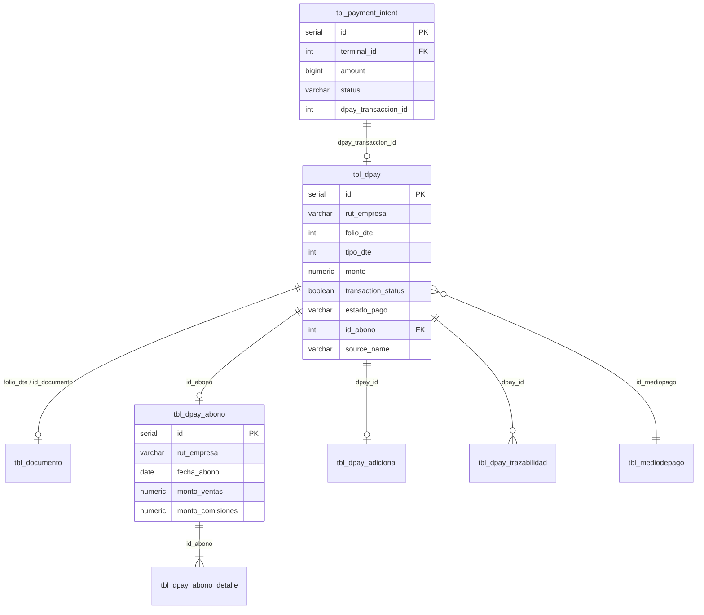

# Base de Datos — D-PAY sobre la plataforma DTemite

D-PAY no tiene una base propia. Persiste en el **PostgreSQL multi-tenant de DTemite**: la venta del celular es la misma fila que el ERP ve en oficina (`tbl_dpay`, `tbl_documento`).

**Fuente SQL:** `nuevodtemite/sql/`. El Capstone documenta el modelo que el POS consume; no rediseña el ERP.

Ver: [00-ecosistema-dtemite.md](./00-ecosistema-dtemite.md)

---

## 1. Modelo multi-tenant

DTemite opera como **SaaS multi-tenant** con PostgreSQL:

| Base de datos | Propósito | Conexión PHP |
|---|---|---|
| **`admin_dtemite`** | Registro global: sistemas, servidores, terminales, Payment Hub, inscripciones | `admin_bd()` |
| **`empresa_{rut}_cl`** (tenant) | ERP del cliente: productos, documentos, **tbl_dpay**, abonos | `cliente_bd_set()` |
| **`dtemiteltda_{rut}_cl`** | Tenant interno DTemite Ltda. | `cliente_dtemiteltda_bd()` |

### Resolución tenant

```
tbl_terminal_pos.idsistema → tbl_sistema.idsistema
tbl_sistema.rutcliente     = rut_empresa
tbl_sistema + tbl_server   → nombrebd → BD cliente
```

Función clave: `Dpay::ObtenerSistema($rut, $sistema)`

---

## 2. Diagrama entidad-relación (DPAY core)



---

## 3. Tabla principal: `tbl_dpay`

**Ubicación:** BD tenant de cada cliente (ej. `empresa_76588454_cl`)  
**Propósito:** Registro de cada transacción del POS D-PAY (efectivo, TUU, Payment Hub).

### Esquema de columnas

| Columna | Tipo | Nullable | Descripción |
|---|---|---|---|
| `id` | SERIAL | NO | PK autoincremental |
| `fecha_hora` | TIMESTAMPTZ | NO | Fecha/hora transacción (default NOW()) |
| `rut_empresa` | VARCHAR(15) | NO | RUT emisor |
| `folio_dte` | INTEGER | SÍ | Folio documento asociado |
| `tipo_dte` | INTEGER | SÍ | 33, 34, 39, 41, 0=sin DTE |
| `id_cliente` | INTEGER | SÍ | FK cliente |
| `rut_cliente` | VARCHAR(12) | SÍ | RUT receptor |
| `nombre_cliente` | VARCHAR(200) | SÍ | Razón social / nombre |
| `email_cliente` | VARCHAR(200) | SÍ | Email cliente |
| `telefono_cliente` | VARCHAR(50) | SÍ | Teléfono |
| `tipo_cliente` | VARCHAR(20) | SÍ | 'registrado' / 'natural' |
| `id_mediopago` | INTEGER | SÍ | FK `tbl_mediodepago` (101=crédito, 104=débito) |
| `monto` | NUMERIC | NO | Monto total transacción (con IVA) |
| `cuotas` | INTEGER | SÍ | Número cuotas (0=débito) |
| `propina` | NUMERIC | SÍ | Propina |
| `cashback` | NUMERIC | SÍ | Cashback TUU |
| `transaction_status` | BOOLEAN | NO | true=aprobado TUU/pasarela |
| `sequence_number` | VARCHAR(50) | SÍ | ID secuencia TUU |
| `codigo_autorizacion` | VARCHAR(50) | SÍ | Código autorización banco |
| `printer_voucher_commerce` | BOOLEAN | SÍ | Si TUU imprime voucher |
| `transaction_tip` | NUMERIC | SÍ | Propina TUU |
| `tax_idn_validation` | VARCHAR(20) | SÍ | Validación RUT titular tarjeta |
| `exempt_amount` | NUMERIC | SÍ | Monto exento |
| `net_amount` | NUMERIC | SÍ | Monto neto |
| `source_name` | VARCHAR(100) | SÍ | Origen: 'DTemite POS', 'D-PAY Webpay', etc. |
| `source_version` | VARCHAR(20) | SÍ | Versión app |
| `custom_fields` | JSONB/TEXT | SÍ | Campos personalizados |
| `tipo_tarjeta` | VARCHAR(20) | SÍ | VISA, DEBITO, Crédito Internac., etc. |
| `ultimos_digitos` | VARCHAR(4) | SÍ | Últimos 4 dígitos tarjeta |
| `tipo_comision` | VARCHAR(10) | SÍ | 'fija' / 'mixta' |
| `comision_porcentaje` | NUMERIC | SÍ | % comisión (1.99, 1.49, 3.99, etc.) |
| `comision_monto_fijo` | NUMERIC | SÍ | Monto fijo ($0, $70, $265) |
| `comision_monto` | NUMERIC | SÍ | Comisión neta (sin IVA) |
| `comision_iva` | NUMERIC | SÍ | IVA 19% sobre comisión |
| `estado_pago` | VARCHAR(20) | NO | Ciclo de vida: pendiente/pagado/anulado/rechazado |
| `fecha_actualizacion` | TIMESTAMPTZ | SÍ | Última modificación estado |
| `id_abono` | INTEGER | SÍ | FK `tbl_dpay_abono` |
| `id_documento_nc` | INTEGER | SÍ | FK documento NC que anuló |
| `folio_nc` | INTEGER | SÍ | Folio NC desnormalizado |
| `motivo_anulacion` | TEXT | SÍ | Texto motivo anulación |
| `response_code` | VARCHAR(40) | SÍ | Código respuesta pasarela |
| `detalle_error` | TEXT | SÍ | Detalle error si falló |
| `request_json` | JSONB/TEXT | SÍ | Payload enviado a pasarela |
| `response_json` | JSONB/TEXT | SÍ | Respuesta completa pasarela |
| `usuario` | VARCHAR(100) | SÍ | Usuario cajero |
| `ip_origen` | TEXT | SÍ | IP del dispositivo |
| `dispositivo` | VARCHAR(100) | SÍ | Modelo dispositivo (ej. POS PRO2) |
| `detalle` | VARCHAR(200) | SÍ | Resumen ítems venta |
| `sistema` | VARCHAR(50) | SÍ | Sistema origen (inyectado API) |
| `marca_tarjeta` | VARCHAR(20) | SÍ | VISA, MASTERCARD, etc. |
| `voucher_data` | TEXT | SÍ | Datos voucher (no usado actualmente) |
| `terminal_id` | VARCHAR(50) | SÍ | ID terminal (no usado TUU) |
| `transaction_id` | VARCHAR(50) | SÍ | ID transacción alternativo |

### Estados de pago (`estado_pago`)

| Estado | Significado | Condición |
|---|---|---|
| `pendiente` | Aprobado por pasarela, pendiente de abono al comercio | transaction_status=true, sin id_abono |
| `pagado` | Incluido en abono y transferido al comercio | id_abono NOT NULL |
| `anulado` | Documento DTE anulado por NC | id_documento_nc NOT NULL |
| `rechazado` | Pasarela rechazó transacción | transaction_status=false |

### Medios de pago (`id_mediopago`)

| ID | Medio | Uso |
|---|---|---|
| 101 | Crédito | Tarjeta crédito vía TUU |
| 104 | Débito | Tarjeta débito vía TUU |

### Tarifas de comisión

| Plan | Nacional | Internacional |
|---|---|---|
| **Fija** | 1,99% + IVA | 3,99% + IVA |
| **Mixta** | 1,49% + $70 + IVA | 2,79% + $265 + IVA |

Cálculo backend (`pos.class.php::calcularComisionConIva`):
- Comisión neta: redondeo half-down (alineado TUU)
- IVA comisión: 19% con round normal

### Índices

```sql
CREATE INDEX idx_dpay_estado_pago ON tbl_dpay (estado_pago);
CREATE INDEX idx_dpay_id_abono ON tbl_dpay (id_abono);
CREATE INDEX idx_dpay_id_documento_nc ON tbl_dpay (id_documento_nc);
-- Implícitos: rut_empresa, fecha_hora (consultas historial)
```

---

## 4. Tabla: `tbl_dpay_abono`

**Propósito:** Registro de abonos (liquidaciones) periódicas al comercio.

| Columna | Tipo | Descripción |
|---|---|---|
| `id` | SERIAL PK | |
| `rut_empresa` | VARCHAR(15) | RUT comercio |
| `fecha_abono` | DATE | Fecha del corte |
| `fecha_desde` / `fecha_hasta` | TIMESTAMPTZ | Período incluido |
| `cantidad_transacciones` | INTEGER | Q transacciones exitosas |
| `monto_ventas` | NUMERIC | Suma bruta ventas (+) |
| `monto_comisiones` | NUMERIC | Comisiones netas (-) |
| `iva_comisiones` | NUMERIC | IVA comisiones (-) |
| `cantidad_anulaciones` | INTEGER | Q anulaciones |
| `monto_anulaciones` | NUMERIC | Ventas anuladas (-) |
| `devolucion_comisiones` | NUMERIC | Comisión devuelta (+) |
| `monto_cobros` | NUMERIC | Cargos adicionales (-) |
| `monto_abono` | NUMERIC | Total abonado al comercio |
| `id_abono_haulmer` | VARCHAR | Sync scraper Haulmer |
| `serial_terminal` | VARCHAR | Terminal asociado |

**Script:** `src/sql/dpay_abono.sql`

---

## 5. Tabla: `tbl_dpay_abono_detalle`

**Propósito:** Detalle de transacciones incluidas en cada abono.

| Columna | Tipo | Descripción |
|---|---|---|
| `id` | SERIAL PK | |
| `id_abono` | INTEGER FK | → tbl_dpay_abono |
| `id_dpay` | INTEGER FK | → tbl_dpay |
| `monto` | NUMERIC | Monto transacción |
| `comision_monto` | NUMERIC | Comisión descontada |
| `serial_terminal` | VARCHAR | Terminal |

---

## 6. Tabla: `tbl_dpay_adicional`

**Propósito:** Líneas extra de ticket impreso vía Payment Hub.

| Columna | Tipo | Descripción |
|---|---|---|
| `id` | SERIAL PK | |
| `dpay_id` | INTEGER FK UNIQUE | → tbl_dpay |
| `payment_intent_id` | INTEGER | Intent Payment Hub |
| `show_logo` | BOOLEAN | Mostrar logo |
| `system_name` | VARCHAR(200) | Nombre comercial |
| `adicional_1` … `adicional_10` | VARCHAR(120) | Líneas ticket |

**Script:** `sql/dpay_adicional.sql`

---

## 7. Tabla: `tbl_dpay_trazabilidad`

**Propósito:** Auditoría de cambios de estado en transacciones DPAY.

Registra eventos: creación, vinculación DTE, anulación, cambio estado_pago.

---

## 8. Tabla: `tbl_dpay_error_tuu`

**Ubicación:** `admin_dtemite` o tenant (según script)  
**Propósito:** Catálogo centralizado de códigos error TUU (HP/ICE) para mapeo en app.

**Script:** `sql/tbl_dpay_error_tuu.sql`

---

## 9. Tablas Payment Hub (`admin_dtemite`)

### `tbl_terminal_pos`

Catálogo global de terminales POS registrados.

| Columna | Tipo | Descripción |
|---|---|---|
| `id` | SERIAL PK | |
| `idsistema` | INT FK | → tbl_sistema |
| `rut_empresa` | VARCHAR(12) | RUT comercio |
| `serial_number` | VARCHAR(64) UNIQUE | Serial hardware |
| `device_fingerprint` | VARCHAR(64) | Android ID D-PAY |
| `terminal_code` | VARCHAR(32) | Código humano (ej. CAJA-01) |
| `display_name` | VARCHAR(128) | Nombre amigable |
| `branch_name` | VARCHAR(128) | Sucursal |
| `status` | VARCHAR(16) | active/inactive |
| `connection_status` | VARCHAR(16) | online/offline |
| `last_heartbeat_at` | TIMESTAMPTZ | Último ping D-PAY |

### `tbl_payment_intent`

Cola de solicitudes de cobro cloud-to-cloud.

| Columna | Tipo | Descripción |
|---|---|---|
| `id` | SERIAL PK | |
| `partner_id` | INT FK | Integrador externo |
| `terminal_id` | INT FK | Terminal destino |
| `external_id` | VARCHAR(128) | ID del integrador |
| `amount` | BIGINT | Monto en CLP |
| `status` | VARCHAR(32) | pending/processing/completed/cancelled/expired |
| `dpay_transaccion_id` | INT | FK tbl_dpay al completar |
| `metadata_json` | JSONB | Datos adicionales |
| `expires_at` | TIMESTAMPTZ | Expiración intent |

### Otras tablas Hub

| Tabla | Propósito |
|---|---|
| `tbl_integracion_partner` | Partners externos (SACMED) + API keys |
| `tbl_partner_merchant` | Autorización partner ↔ comercio |
| `tbl_webhook_outbox` | Cola entrega webhooks |
| `tbl_payment_intent_event` | Trazabilidad intents |

**Script:** `sql/paymenthub.sql`

---

## 10. Tabla: `tbl_inscripcion_dpay` (`admin_dtemite`)

**Propósito:** Formulario público de inscripción de nuevos comercios DPAY.

Campos principales:
- Datos empresa (RUT cifrado AES-256-GCM, rut_hash HMAC-SHA256)
- Representante legal (datos cifrados)
- Certificado digital (.pfx)
- Cuenta bancaria abono (número cifrado)
- Tipo comisión: '1.99' / '1.49_70'
- Estado: pendiente / revisado

**Script:** `sql/inscripcion_dpay.sql`

---

## 11. Tabla: `tbl_dpos_config` (tenant)

**Propósito:** Configuración módulo D-POS web.

| Columna | Descripción |
|---|---|
| `consumidor_final_rut` | Default '66666666-6' |
| `consumidor_final_nombre` | Default 'PUBLICO GENERAL' |
| `config_json` | Config por tipo DTE |

**Script:** `sql/dpos.sql`

---

## 12. Relación con documentos tributarios

```
tbl_dpay.folio_dte  ←→  tbl_documento.folio
tbl_dpay.tipo_dte   ←→  tbl_documento.id_td
```

Flujo de vinculación:
1. `POST /pos/transaccion` → crea fila tbl_dpay (puede ser antes o después del DTE)
2. Emisión DTE → obtiene folio + id_documento
3. `PUT /pos/transaccion/{id}/dte` → vincula folio_dte, tipo_dte, id_documento

Consulta historial unificada: `POST /dpay/documentos` (JOIN tbl_dpay + tbl_documento)

---

## 13. API → BD (mapeo mobile)

| Endpoint | Tabla(s) afectada(s) | Operación |
|---|---|---|
| `POST /login` | tbl_usuario, tbl_sistema | SELECT |
| `GET /producto` | tbl_producto | SELECT |
| `GET /cliente` | tbl_cliente | SELECT |
| `POST /dpay/cliente` | tbl_cliente | INSERT |
| `GET /folios/caf` | tbl_ctrl_folio | SELECT |
| `GET /pos/comisiones` | tbl_dpay_comision_config | SELECT |
| `POST /pos/transaccion` | **tbl_dpay** | INSERT |
| `PUT /pos/transaccion/{id}/dte` | **tbl_dpay** | UPDATE |
| `PUT /pos/transaccion/{id}/anular` | **tbl_dpay**, tbl_dpay_trazabilidad | UPDATE |
| `POST /dpay/documentos` | tbl_dpay + tbl_documento | SELECT JOIN |
| Payment Hub complete | tbl_payment_intent + **tbl_dpay** | UPDATE + INSERT |

---

## 14. Scripts SQL de referencia

| Archivo | BD | Descripción |
|---|---|---|
| `src/sql/dpay_abono.sql` | Tenant | Ciclo vida + abonos |
| `sql/dpay_adicional.sql` | Tenant | Ticket extra Hub |
| `sql/paymenthub.sql` | admin_dtemite | Payment Hub |
| `sql/inscripcion_dpay.sql` | admin_dtemite | Inscripciones |
| `sql/dpos.sql` | Tenant | Config D-POS |
| `sql/dpay_abono_haulmer_alter.sql` | Tenant | Sync Haulmer |
| `sql/tbl_dpay_error_tuu.sql` | Admin | Catálogo errores |
| `sql/alter_tbl_dpay_response_code.sql` | Tenant | Columna response_code |
| `src/sql/dpay_cancelacion.sql` | Tenant | Campos cancelación abono |

---

## 15. Cómo D-PAY escribe `tbl_dpay`

Cada venta del POS se registra con `POST /pos/transaccion`. Campos típicos:

```json
{
  "source_name": "DTemite POS",
  "source_version": "3.0.0",
  "id_mediopago": 101,
  "transaction_status": true,
  "codigo_autorizacion": "<authCode TUU o vacío en efectivo>",
  "dispositivo": "<modelo>",
  "estado_pago": "pendiente"
}
```

Efectivo no trae `authCode`. TUU sí. El DTE se vincula después con `PUT /pos/transaccion/{id}/dte`.

---

## 16. Completitud de datos (análisis agosto 2026)

Según `codigo/ANALISIS_DPAY.md`:

| Métrica | Valor actual | Objetivo |
|---|---|---|
| Campos enviados | 32/42 (~76%) | ≥ 35/42 (~83%) |
| authCode, last4 | ✅ Implementado | — |
| dispositivo | ✅ Hardcoded POS PRO2 | Dinámico con DeviceInfo |
| ip_origen | ⚠️ Pendiente | NetInfo |
| marca_tarjeta | ⚠️ Pendiente confirmación TUU | — |

---

**Revisión:** v1.0 — 28 agosto 2026
