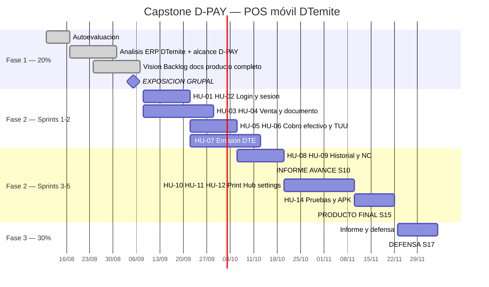

# Carta Gantt — Capstone D-PAY 3.0

**Periodo:** 2026-2 · **18 semanas**  
**Guía:** APT122 — Fabián Alcántara Guajardo  
**Revisión:** v2.0 — 9 septiembre 2026

---

## 1. Calendario oficial

| Semana | Fechas | Hito | % |
|:---:|---|---|---|
| 1 | Inicio agosto 2026 | Kick-off | — |
| **4** | **31/08 – 05/09/2026** | **Fase 1 exposición** | **20%** |
| **10** | **12/10 – 17/10/2026** | **Informe avance** | **20%** |
| **15** | ~16/11 – 22/11/2026 | **Producto final** | **30%** |
| 16 | 23/11 – 28/11/2026 | Cierre Fase 2 | — |
| **17** | **30/11 – 05/12/2026** | **Defensa APT** | **30%** |
| 18 | 07/12 – 12/12/2026 | Empresas / repo | — |

Feriados: 18–19 sep (Fiestas Patrias), 1 nov.

---

## 2. Fases

| Fase | Semanas | % | Entregable |
|---|---|---|---|
| Definición | 1–4 | 20% | Vision del POS, Backlog, docs, exposición |
| Desarrollo | 5–15 | 50% | Informe S10 + APK del POS S15 |
| Presentación | 16–18 | 30% | Defensa, video del flujo de caja |

---

## 3. Gantt



---

## 4. Semana a semana

| Sem | Fase | Actividad | Evaluable |
|:---:|---|---|---|
| 1–3 | F1 | Kick-off, análisis DTemite vs D-PAY, docs | Individuales |
| **4** | **F1** | **Exposición: D-PAY como POS completo** | **20%** |
| 5–6 | F2 | Login, sesión, venta | Demo S1 |
| 7–8 | F2 | Documento, cobro, DTE | Demo S2 |
| 9–10 | F2 | Historial, NC, informe | **20% S10** |
| 11–14 | F2 | Impresión, Hub, settings, buffer | — |
| **15** | **F2** | **APK + flujo completo** | **30%** |
| 16–18 | F3 | Defensa | **30% S17** |

---

## 5. Entregables formales

| Código | Semana | Estado |
|---|---|---|
| 1.1 / 1.2 | 1 | En `fase1/individuales/` |
| 1.5 | 4 | Pendiente plantilla Duoc |
| Informe avance | 10 | Pendiente |
| 2.7 | 16 | Pendiente |
| 3.1 / 3.3 / 3.4 | 16–17 | Pendiente |

---

## 6. Ruta crítica

```
S4 (definir el POS) → S5-S8 (venta + cobro + DTE) → S10 (informe) → S15 (APK) → S17 (defensa)
```

Riesgo: sin DTE demostrable no hay producto. Mitigación: HU-07 parte en Sprint 2; el flujo efectivo + boleta es el mínimo defendible.

---

**Revisión:** v2.0 — 9 septiembre 2026
