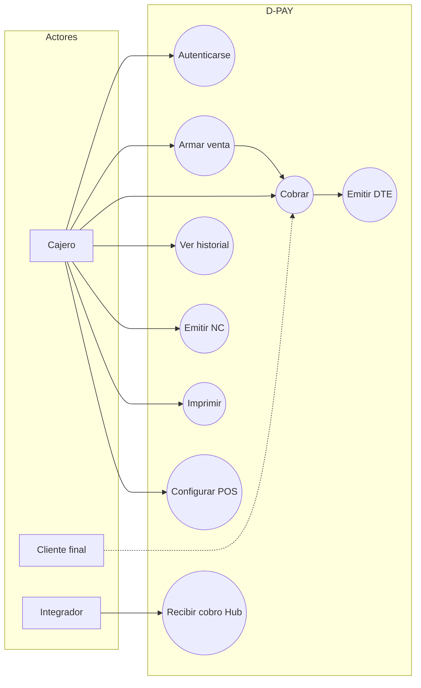
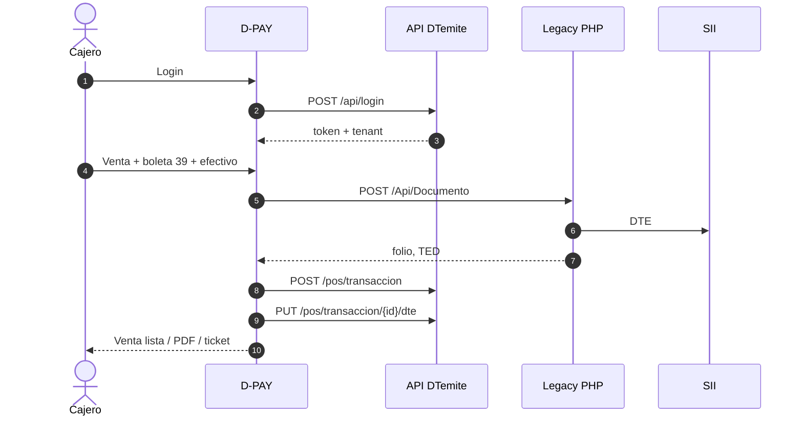
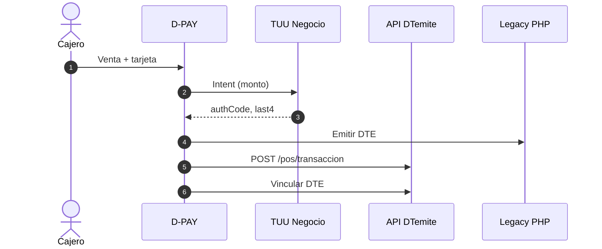
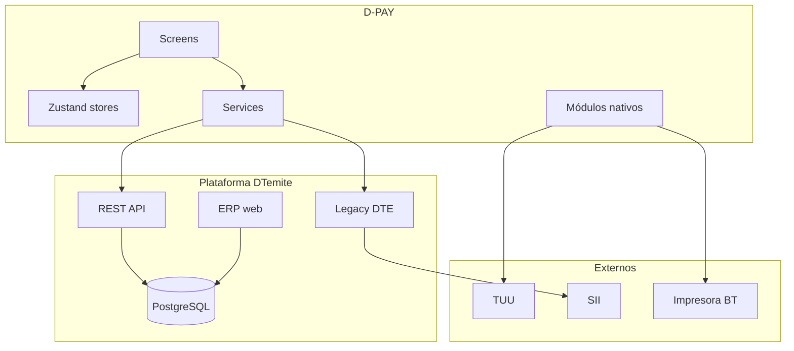
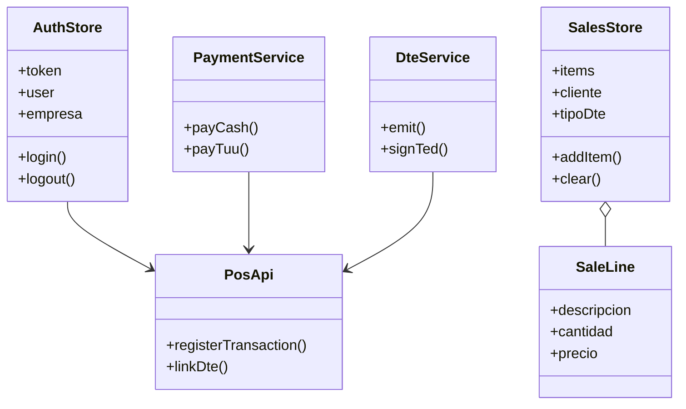

# Diagramas UML — D-PAY 3.0

Diagramas mínimos de la guía APT122. El caso principal es **realizar una venta completa** (cobro + DTE), no un módulo de pasarelas.

---

## 1. Casos de uso

### Actores

| Actor | Descripción |
|---|---|
| **Cajero / comerciante** | Usuario de D-PAY |
| **Cliente final** | Quien paga |
| **Integrador** | Sistema externo vía Payment Hub |
| **Plataforma DTemite** | API REST + Legacy + BD |
| **TUU** | Pasarela de tarjeta en Kozen |
| **SII** | Receptor del DTE |

### Diagrama

### CU-02/03/04 — Venta + cobro + DTE (principal)

| Campo | Valor |
|---|---|
| **Actor** | Cajero |
| **Precondición** | Sesión activa, catálogo/CAF disponibles |
| **Flujo** | 1. Ítems 2. Tipo DTE y cliente 3. Efectivo o TUU 4. Emitir DTE si aplica 5. Registrar `tbl_dpay` 6. Imprimir |
| **Extensiones** | Pago rechazado; sin red (efectivo offline); tipo 0 sin SII |
| **Postcondición** | Venta en historial; DTE en SII si correspondía |

---

## 2. Secuencia — venta efectivo + boleta

### Secuencia — venta tarjeta TUU (Kozen)

---

## 3. Componentes

---

## 4. Clases (dominio mobile)

---

## 5. Despliegue

Ver [05-arquitectura.md](./05-arquitectura.md) §8.

Datos persistidos relevantes:

- `tbl_dpay` — transacción POS (tenant)
- `tbl_documento` — DTE
- `tbl_payment_intent` — cola Hub (`admin_dtemite`)

---

**Revisión:** v2.0 — 9 septiembre 2026
